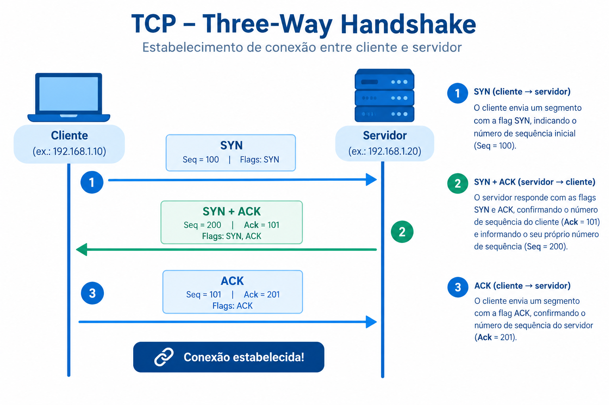

# 1. Fundamentos de Sockets TCP

## 1.1. Conceito e Funcionamento do Socket TCP
Um socket atua como uma interface de software (API) entre o processo de aplicação e a camada de transporte dentro de um hospedeiro, funcionando de maneira análoga a uma porta por onde as mensagens entram e saem da rede. O protocolo TCP é orientado a conexão, o que exige que o cliente e o servidor realizem um processo de apresentação inicial em três etapas (three-way handshake) para estabelecer os parâmetros antes do envio dos dados da aplicação.

  

A conexão resultante é full-duplex, dados podem fluir em ambas as direções simultaneamente, e ponto a ponto.
